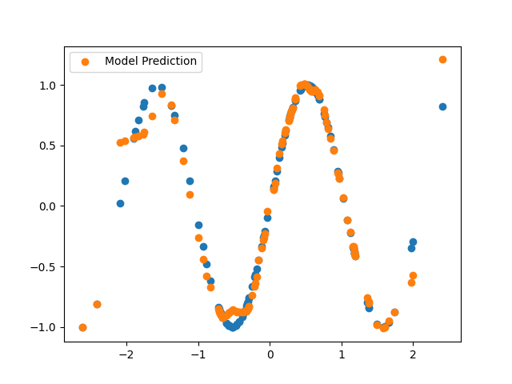

# JAX Basics

A personal learning repository for exploring the JAX framework - Google's library for high-performance numerical computing and automatic differentiation.

## About

This repository contains Jupyter notebooks with code examples, experiments, and detailed explanations as I learn JAX. The notebooks progress from basic concepts to more advanced topics, including common gotchas and state management patterns.

## Notebooks

### 1. [JAX Warmup](1_JAX_warmup.ipynb)
Introduction to JAX fundamentals:
- NumPy-like syntax and array operations
- Immutable arrays and the `.at()` syntax
- Random number generation with explicit key management
- AI accelerator agnostic computing (GPU/TPU)
- Core transform functions:
  - `jit()` - Just-in-time compilation for performance
  - `grad()` - Automatic differentiation (including Jacobians and Hessians)
  - `vmap()` - Automatic vectorization across batches

### 2. [JAX Basics](2_JAX_basics.ipynb)
Deep dive into JAX fundamentals and common pitfalls:
- Understanding pure functions and why they matter
- **Gotcha #1**: Pure Functions - side effects and global state
- **Gotcha #2**: In-Place Updates - using `.at()` for array modifications
- **Gotcha #3**: Out-of-Bounds Indexing - non-error behavior
- **Gotcha #4**: Non-array Inputs - strict type requirements
- **Gotcha #5**: Random Numbers - explicit PRNG key management
- **Gotcha #6**: Control Flow - JIT compilation considerations

### 3. [JAX Basics II](3_JAX_basics_II.ipynb)
Advanced patterns and state management:
- The problem of state in functional programming
- Why stateful code breaks with JIT compilation
- Implementing stateful patterns (e.g., counters) in JAX
- **PyTrees** - JAX's way of handling complex data structures
  - Understanding PyTree structure and leaves
  - Manipulating PyTrees with `tree.map`
  - Handling gradients for models with many parameters
- Foundation for building neural networks in JAX

### 4. [JAX MLP](4_JAX_MLP.ipynb)
Building and training a Multi-Layer Perceptron from scratch:
- Initializing neural network parameters with `init_mlp_params`
- **He Initialization** - proper weight initialization for deep networks
  - Understanding exploding and vanishing activations
  - Why `sqrt(2/n_in)` scaling matters
  - Keeping variance stable across layers
- **Forward propagation** with ReLU activation
- **Loss function** - Mean Squared Error (MSE)
- **Gradient descent** - automatic differentiation with `jax.grad()`
- **Training loop** - iterative parameter updates
- **PyTree magic** - updating all parameters with `tree.map()`
- Practical examples: learning y = x² and y = sin(3x)


*Successfully trained MLP learning a sine function*

### 5. [JAX Custom PyTrees](5_JAX_Custom_PyTrees.ipynb)
Understanding and creating custom PyTree nodes:
- Why JAX can't traverse custom classes by default
- **Custom PyTree registration** with `register_pytree_node()`
- Implementing `flatten` and `unflatten` functions
  - Children (trainable parameters) vs auxiliary data (metadata)
  - How JAX decomposes and reconstructs objects
- **Common gotcha**: Tuples as PyTree containers vs leaves
  - Understanding tree structure of shape tuples
  - Solutions: `is_leaf` parameter and direct mapping
- Foundation for building custom neural network layers
- Essential for creating reusable ML components

### 6. [JAX Parallelism](6_JAX_Parallelism.ipynb)
Parallel computing patterns in JAX:
- **GPU limitations on Windows** - native support via WSL2 only
- Understanding device detection with `jax.devices()` and `jax.local_device_count()`
- **vmap (vectorized map)** - automatic vectorization for batches
  - How `in_axes` controls mapping behavior
  - Efficient batch processing without explicit loops
- **pmap (parallel map)** - multi-device parallel execution
  - Running computations across multiple GPUs/TPUs
  - Zero cross-device communication for independent operations
- **1D Convolution example** - practical parallel computing demonstration
- Using `repr()` for debugging object representations

### 7. [JAX Simple Parallel Training](7_JAX_Simple_Parallel_Training.ipynb)
Practical parallel training patterns:
- **Parallel linear regression** with `pmap`
- Parameter replication across devices
- **Gradient synchronization** with `pmean`
- Complete training loop with loss logging
- **stop_gradient** for advanced training
  - TD(0) temporal difference learning (Reinforcement Learning)
  - Preventing gradient flow through target values
  - Value function training example
- Understanding when to freeze parts of computation

### 8. [Building Neural Networks from Scratch](8_JAX_Building_NN_From_Scratch.ipynb)
Complete MLP implementation for MNIST classification:
- **MLP initialization** with JAX random keys
- Proper random key splitting for reproducibility
- **Log-softmax** for numerical stability
  - Why `logits - logsumexp(logits)` prevents overflow
  - Stable probability computation
- **PyTorch DataLoader integration** with JAX
- Custom transforms for PIL to NumPy conversion
- Custom collate functions for JAX compatibility
- MNIST dataset preparation
- Batched predictions with `vmap`

### 9. [JAX FLAX](9_JAX_FLAX.ipynb)
Introduction to high-level neural network libraries for JAX:
- **FLAX** - Google Research's flexible NN library
  - Module-based architecture (similar to PyTorch)
  - Initialization pattern: `init()` and `init_with_output()`
  - Apply pattern: `model.apply(params, x)` for forward pass
  - FrozenDict for immutable parameters
- **Haiku** - DeepMind's NN library with transform pattern
- **Optax** - JAX optimizer library by DeepMind
  - SGD, Adam, and other optimizers
  - Pattern: `optimizer.init()` then `optimizer.update()`
- **Custom models** with `nn.Module`
  - Using `setup()` or `@nn.compact` decorator
  - Defining trainable parameters with `self.param()`
  - Managing non-trainable state with `self.variable()`
- **Multiple state collections**
  - `params` - trainable parameters
  - `batch_stats` - non-trainable variables (BatchNorm)
  - `dropout` - RNG keys for stochastic layers
- **Training vs evaluation mode** for Dropout and BatchNorm
- Complete linear regression example with FLAX
- Building custom MLP from scratch with FLAX

## Topics Covered

- ✅ Basic JAX operations and NumPy compatibility
- ✅ Automatic differentiation with `grad`, `jacfwd`, `jacrev`
- ✅ Just-in-time compilation with `jit`
- ✅ Vectorization with `vmap`
- ✅ Random number generation with PRNG keys
- ✅ Pure functional programming patterns
- ✅ State management in functional style
- ✅ PyTrees for complex data structures
- ✅ Common gotchas and how to avoid them
- ✅ Neural network parameter initialization (He initialization)
- ✅ MLP forward propagation with ReLU activation
- ✅ Loss functions (Mean Squared Error)
- ✅ Gradient descent optimization with `tree.map()`
- ✅ Complete training loops
- ✅ Custom PyTree registration for custom classes
- ✅ Flatten/unflatten functions for PyTree nodes
- ✅ PyTree gotchas (tuples as containers vs leaves)
- ✅ Automatic vectorization with `vmap`
- ✅ Multi-device parallelism with `pmap`
- ✅ Understanding `in_axes` for batch processing
- ✅ Cross-device communication with `psum` and `pmean`
- ✅ Parallel training with gradient synchronization
- ✅ stop_gradient for controlling gradient flow
- ✅ Log-softmax for numerical stability
- ✅ MNIST dataset integration with JAX
- ✅ Custom data loading with PyTorch DataLoader
- ✅ FLAX neural network library (nn.Module, init, apply)
- ✅ Optax optimizers (SGD, Adam, etc.)
- ✅ Managing trainable and non-trainable state in FLAX
- ✅ Custom FLAX models with @nn.compact decorator
- ✅ FrozenDict for immutable parameters
- ✅ BatchNorm and Dropout with FLAX
- ✅ Complete CNN architecture with FLAX
- ✅ MNIST training and evaluation pipeline
- ✅ TrainState for managing training state

## Setup

```bash
# Basic installation
pip install jax jaxlib

# For visualization examples
pip install matplotlib
```

For GPU support:
```bash
# Linux/WSL2 only - Windows native GPU not supported
pip install --upgrade "jax[cuda12]"
```

**Note on Windows GPU Support:**
- JAX does **not** natively support CUDA on Windows
- For GPU acceleration on Windows, use **WSL2** (Windows Subsystem for Linux)
- Alternatively, use Google Colab for free GPU/TPU access
- CPU-only installation works fine for learning JAX concepts

## Project Status

✅ **COMPLETED** - This learning project has been successfully completed!

All 9 notebooks have been finished, covering JAX fundamentals from basic operations to building complete neural networks with FLAX. The journey progressed from understanding JAX's functional programming paradigm to implementing production-ready CNN models for MNIST classification.

## Key Takeaways

- JAX arrays are **immutable** - use `.at()` methods instead of in-place operations
- JAX requires **pure functions** for transformations like `jit` and `grad`
- Random numbers require **explicit key management** - no global state
- State must be **explicitly passed** as function arguments and return values
- JIT compilation provides significant **performance improvements**
- Same code runs on **CPU, GPU, or TPU** without modification
- FLAX provides a **high-level API** similar to PyTorch while maintaining JAX's functional nature
- TrainState simplifies **managing training state** (params, optimizer state, apply function)

## Resources

- [JAX Documentation](https://jax.readthedocs.io/)
- [JAX GitHub Repository](https://github.com/google/jax)
- [JAX Quickstart](https://jax.readthedocs.io/en/latest/quickstart.html)
- [JAX Gotchas](https://jax.readthedocs.io/en/latest/notebooks/Common_Gotchas_in_JAX.html)
